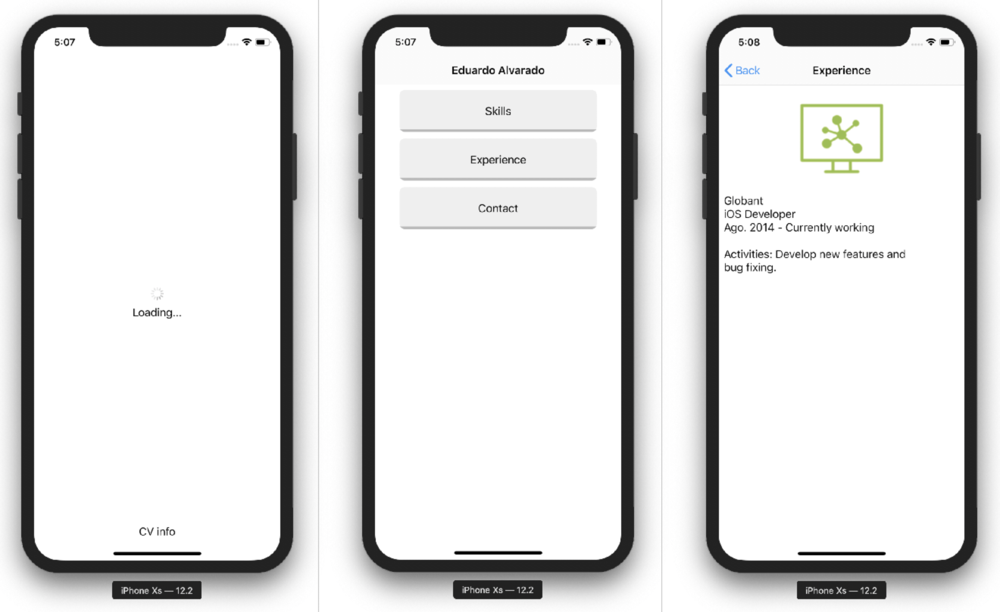
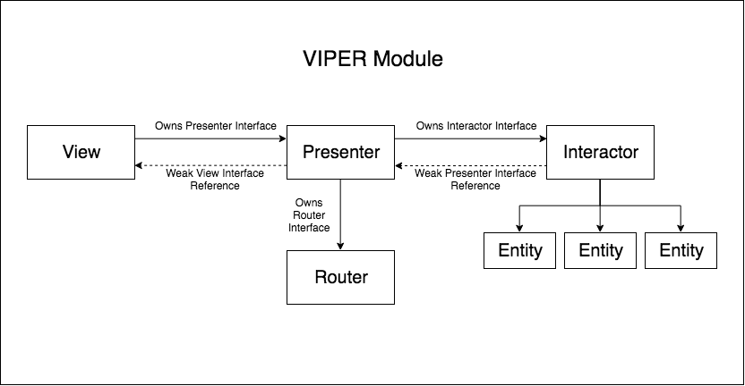
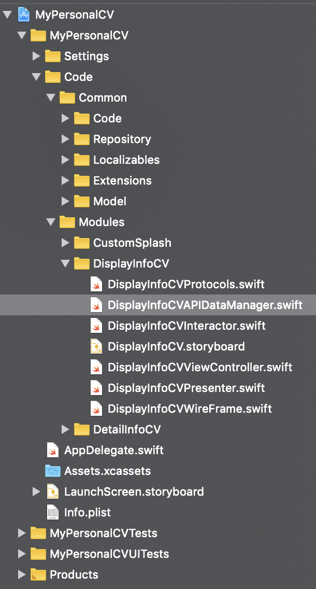

# My personal CV
The idea of ​​this project is to present in a simple way the information of a Curriculum Vitae using a robust architecture like **VIPER**.

The view is very simple, it has a loading screen, a home screen and a detail screen.



The objective is to use VIPER to illustrate _good programming practices_ and encourage the use of _unit tests_.

VIPER is an acronym for View, Interactor, Presenter, Entity and Router. This architecture is based on Principles of Unique Responsibility, which guides towards a cleaner architecture, to have a better structure of the iOS project.



The idea behind this architecture pattern is to separate the dependencies of the application, balancing the delegation of responsibilities between the entities. Basically, the Viper architecture divides your application logic into smaller layers of functionality, each with a predefined responsibility. This makes testing the interactions of the layers easier by using protocols.

## Set up
This project is configured to execute the service that brings the CV information correctly, but if the service route is modified, the case where the data fails to load can be executed.



Inside DisplayInfoCVAPIDataManager, you must change `fetchSuccess` to `fechFail` in order to test the Endpoint for wrong format.

```Swift
func fetchInfoCVData(completion: @escaping (APIResult<InfoCVModel,APIError>) -> Void) {
    repository?.callService(url: Endpoints.GetCVInfo.fetchSuccess.url,
                            completion: completion)
}
```

These scenarios are included in the unit tests using mocks.

## Requirements
- Xcode 10.0+
- Swift 4.0+
- iOS 10.0+
